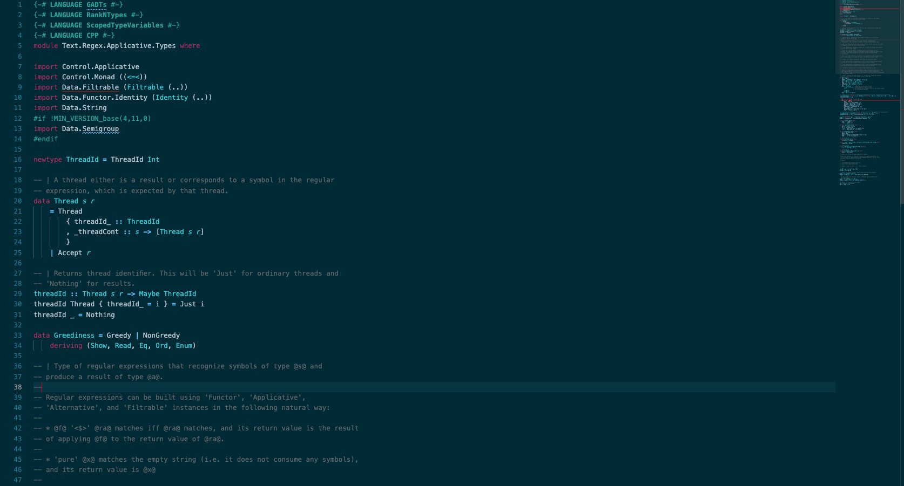

# Hackage Dark Theme

Dark mode color theme that was inspired by the source code displayed in [hackage](https://hackage.haskell.org/), the Haskell documentation site.

## Installation

https://marketplace.visualstudio.com/items?itemName=dmarticus.hackage-dark-theme

Install using Command Palette
Go to View -> Command Palette or press Cmd+Shift+P (Ctrl+Shift+P on Windows)
Then enter Install Extension
Write hackage-dark-theme
Select it or press Enter to install

## Screenshot

